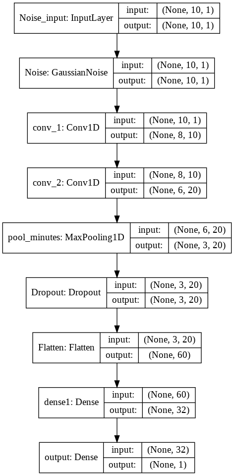
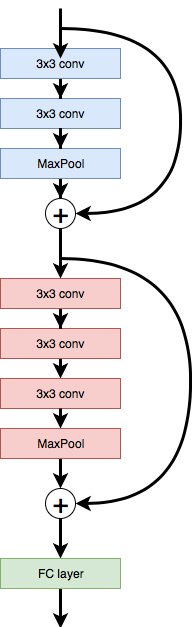

# Term Project for W4995 Sec:10 Deep Learning. 
# DQNAgent with Vision
## Introduction
Reinforcement Learning is a framework where we trained a agent to make best actions in response to the environment. It allows the agent to find the best strategy in games like Atari. Stock trading is no doubt one of those games that reinforcement learning could explore. Although, the stock market is not a Markov process, we could include part of its history to make the process Markovian. Thus, we
can introduce deep reinforcement learning to financial data modelling. During this project, we explored the potential of training Deep Q-Learning agent (DQNAgent) to learn portfolio management and build a time series predictor with Convolution Network as well as ResNet. Furthermore, we combine the two architecture to create a DQNAgent with time series predictability.

##  Dataset
we track the daily close price of 30 stocks in the Dow Jones Index. Average (DJIA)  from 01/01/1995 to 12/31/2018.  The model will be trained on data from 01/01/1995 to  12/31/2013 and validated on data from 01/01/2014 to  12/31/2016. Then we will test our model on the stock price from 01/01/2017 to 12/31/2018. The dataset can be acquired
from yahoo finance API.

## Method (Architecture)
### Deep Q-Learning

### Time Series prediction
- CNN Predictor

- ResNet Predictor  

###  Architecture of our trading agent: Agent with Vision

## Results
We trained the agent on data from 01/01/1995 to 12/31/2015 and validated on the year 2016. Then we will test our model on the data from 01/01/2017 to 12/31/2018.

### Deep Q-Learning

### Time Series prediction
- CNN Predictor

- ResNet Predictor 
    - 

###  Agent with Vision

