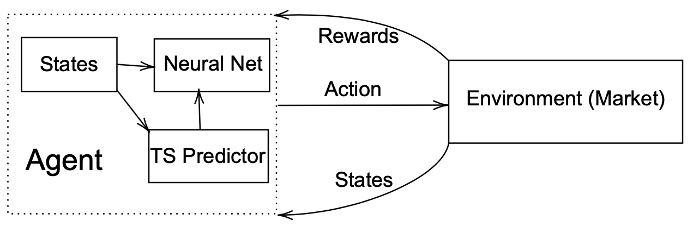
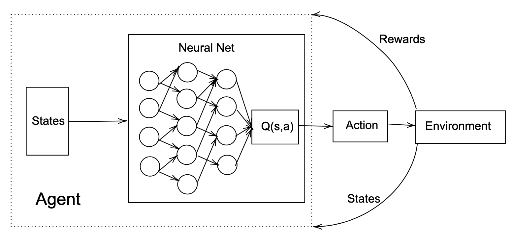
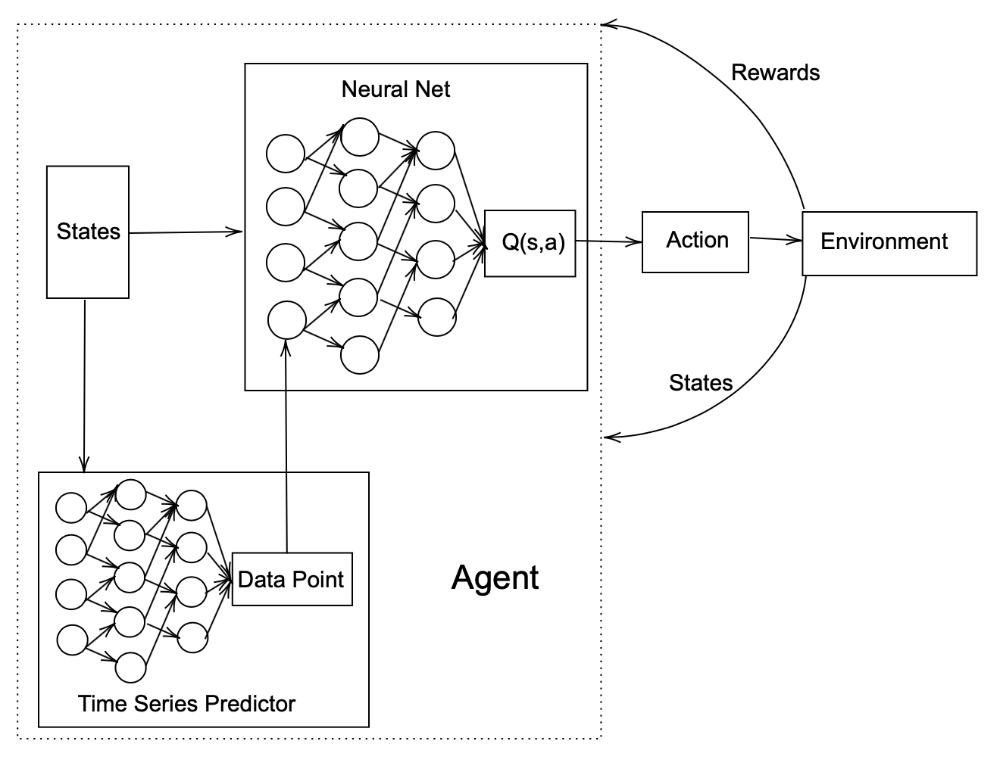
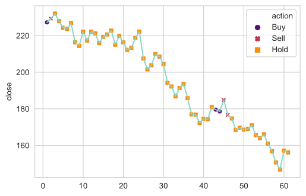
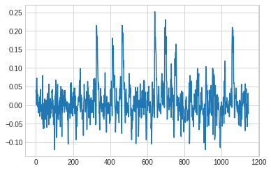
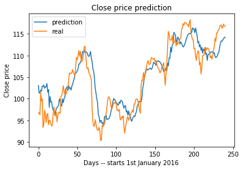
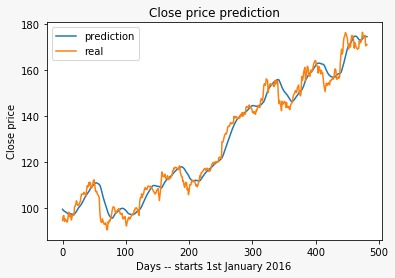
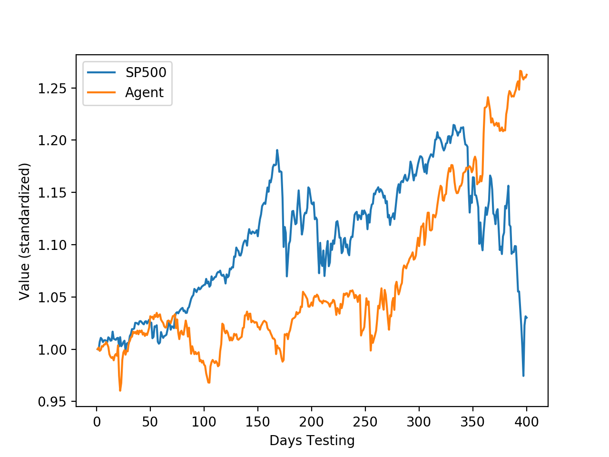

# Term Project for W4995 Sec:10 Deep Learning. 
# DQNAgent with Vision
## Introduction
Reinforcement Learning is a framework where we trained a agent to make best actions in response to the environment. It allows the agent to find the best strategy in games like Atari. Stock trading is no doubt one of those games that reinforcement learning could explore. Although, the stock market is not a Markov process, we could include part of its history to make the process Markovian. Thus, we
can introduce deep reinforcement learning to financial data modelling. During this project, we explored the potential of training Deep Q-Learning agent (DQNAgent) to learn portfolio management and build a time series predictor with Convolution Network as well as ResNet. Furthermore, we combine the two architecture to create a DQNAgent with time series predictability.



##  Dataset
We track the daily close price of 30 stocks in the Dow Jones Index. Average (DJIA)  from 01/01/1995 to 12/31/2018.  The model will be trained on data from 01/01/1995 to  12/31/2013 and validated on data from 01/01/2014 to  12/31/2016. Then we will test our model on the stock price from 01/01/2017 to 12/31/2018. The dataset can be acquired
from yahoo finance API.

## Environment
```
python --vision: python 3.7.4
Keras == 2.3.1
notebook == 6.0.1    
numpy  == 1.17.2      
pandas == 0.25.1    
scipy  == 1.3.1    
seaborn  ==  0.9.0      
scikit-learn  == 0.21.3      
tensorflow ==  2.0.0    
yahoo-finance-api2 == 0.0.8    
```
## Usage
```python
python3 -m pip install -r requirements.txt
python3 portoflio_testing.py
```

## Method (Architecture)
### Deep Q-Learning
The very basic idea is that we train a agent play a game call stock trading. Agent observes the a series of data points, which are stock prices, from the environment. It has three actions, Sell, Buy and Hold4. The agent observe the environment pass the state into the neural network to make decisions on the action. Then, the environment will return a new state and give a reward. In this case, if the agent is selling the stock, the reward is the immediate return by this bet.


### Time Series prediction
- CNN Predictor
Before, we focused on trading strategies, in this part we
focus on another problem: predicting time series using
neural networks. A time series could be seen as a sequence
of data points [S<sub>1</sub>,S<sub>2</sub>,...,S<sub>t</sub>,...] .
Then we arrive to a new problem. Using previous values,
are we able to predict future? In other words, for a fixed
value of p, using  [S<sub>t-p</sub>,...,S<sub>t</sub>]  are we able to predict S<sub>t+1</sub>?
This representation seems like an image in one dimension.
Thus as convolutional neural networks are used to
recognize forms and patterns in an image, convolution in
1 dimension might help us to detect increase, decrease or
plateaus in time series.
- ResNet Predictor  
We show in the results section that even if the architecture
described above seems to be a good idea it lacks of
stability. It catches sometimes really well the patterns of
time series such as increasing, decreasing etc., however it
sometimes does not succeed to converge at all.
In other words, the stability of the model was a challenging
issue. To handle it, one idea comes directly from image classification:
the ResNet. These architectures are not provided
in classical packages because we proceed 1-dimensional
convolution on time series. Moreover the length of time
series vectors are very smaller than the wide image matrices.
Hence we built a ResNet-like architecture adapted to small
data and 1-dimensional convolution.

###  Architecture of our trading agent: Agent with Visions


## Results
We trained the agent on data from 01/01/1995 to 12/31/2015 and validated on the year 2016. Then we will test our model on the data from 01/01/2017 to 12/31/2018.

### Deep Q-Learning



### Time Series prediction
- CNN Predictor <br>


- ResNet Predictor <br>


###  Agent with Vision

<!--  -->

| model      | Rate of Return  | Sharpe Ratio     |
| :------------- | :----------: | -----------: |
|  S&P500 (Benchmark)    | 5.32%          | 0.018   |
| DQNAgent (Single)        | Put Pipes In |  0.65 |
| DQNAgent (Portfolio)   | 13.13%         | 0.67 |
|DQNAgent (New, Portfolio) | 14.15% | 1.1 |


## Conclusions
In this paper, we explored the potential of training Deep Q Learning agent (DQNAgent) to learn portfolio management
and build a time series predictor with Convolution Network
as well as ResNet. Furthermore, we combine the two architecture
to create a DQNAgent with time series predictability.
Result shows that both the DQNAgent and the new architecture
outperformed S&P500 in terms of annualized return
and Sharpe ratio, indicating that the agent balance risk and
return better than the benchmark.

## Reference
[1] Martin, L., Lars, K., and Amy, L. A review of unsupervised
feature learning and deep learning for time-series
modeling. Pattern Recognition Letters 42, 2014.

[2] Mnih, V., Kavukcuoglu, K., Silver, D., Graves, A.,
Antonoglou, I., Wierstra, D., and Riedmiller, M. Playing
atari with deep reinforcement learning. arXiv preprint
arXiv:1312.5602, 2013.

[3] Xiong, Z., Liu, X.-Y., Zhong, S., Walid, A., et al. Practical
deep reinforcement learning approach for stock trading.
arXiv preprint arXiv:1811.07522, 2018.